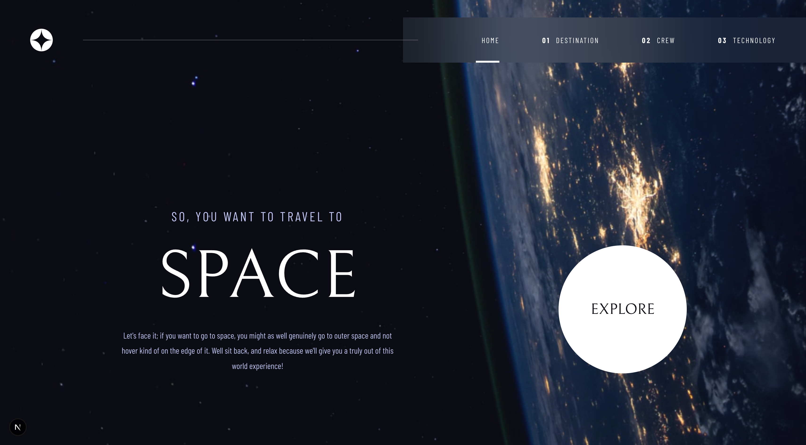

# Frontend Mentor - Space tourism website solution

This is a solution to the [Space tourism website challenge on Frontend Mentor](https://www.frontendmentor.io/challenges/space-tourism-multipage-website-gRWj1URZ3). Frontend Mentor challenges help you improve your coding skills by building realistic projects.

## Table of contents

-   [Overview](#overview)
    -   [The challenge](#the-challenge)
    -   [Screenshot](#screenshot)
    -   [Links](#links)
-   [My process](#my-process)
    -   [Built with](#built-with)
    -   [What I learned](#what-i-learned)
    -   [Continued development](#continued-development)
-   [Author](#author)

**Note: Delete this note and update the table of contents based on what sections you keep.**

## Overview

### The challenge

Users should be able to:

-   View the optimal layout for each of the website's pages depending on their device's screen size
-   See hover states for all interactive elements on the page
-   View each page and be able to toggle between the tabs to see new information

### Screenshot



### Links

-   Solution URL: [Solution URL](https://www.frontendmentor.io/solutions/space-tour-with-nextjs-and-tailwindcss-_Fmxu9o6-P)
-   Live Site URL: [Space Tour](https://space-tour-eight.vercel.app/)

## My process

### Built with

-   Semantic HTML5 markup
-   CSS custom properties
-   Flexbox
-   Tailwind
-   [React](https://reactjs.org/) - JS library
-   [Next.js](https://nextjs.org/) - React framework

### What I learned

How to Change Images and backgrounds dynamically.

```
        <div
            className={` ${
                current === "HOME" &&
                "bg-[url(/assets/home/background-home-mobile.jpg)] md:bg-[url(/assets/home/background-home-tablet.jpg)] xl:bg-[url(/assets/home/background-home-desktop.jpg)]"
            } ${
                current === "DESTINATION" &&
                "bg-[url(/assets/destination/background-destination-mobile.jpg)] md:bg-[url(/assets/destination/background-destination-tablet.jpg)] xl:bg-[url(/assets/destination/background-destination-desktop.jpg)]"
            }
            ${
                current === "CREW" &&
                "bg-[url(/assets/crew/background-crew-mobile.jpg)] md:bg-[url(/assets/crew/background-crew-tablet.jpg)] xl:bg-[url(/assets/crew/background-crew-desktop.jpg)]"
            } ${
                current === "TECHNOLOGY" &&
                "bg-[url(/assets/technology/background-technology-mobile.jpg)] md:bg-[url(/assets/technology/background-technology-tablet.jpg)] xl:bg-[url(/assets/technology/background-technology-desktop.jpg)]"
            } bg-no-repeat bg-cover flex flex-col min-h-screen xl:h-screen w-screen`}
        >
            <Navbar nav={nav} current={current} setCurrent={setCurrent} />

            {current === "HOME" && <HomePage setCurrent={setCurrent} />}
            {current === "DESTINATION" && (
                <Destination destinations={data.destinations} />
            )}
            {current === "CREW" && <Crew crew={data.crew} />}
            {current === "TECHNOLOGY" && (
                <Technology technology={data.technology} />
            )}

        </div>
```

really loved how I can change the background depending on the screen size.

### Continued development

Would continue to work on navbar animations and making the transitions look fuild.

## Author

-   Website - [Space-Tour](https://www.your-site.com)
-   Frontend Mentor - [@J33rry](https://www.frontendmentor.io/profile/J33rry)
